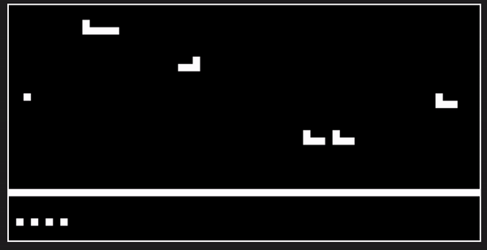

# Chip8Emulator
This is an emulator/Interpreter for chip8 programming language

# Chip-8

Chip-8 is an interpreted programming language primarily used to create simple video games for early microcomputers. It was originally developed in the mid-1970s for the COSMAC VIP and Telmac 1800 microcomputers. Chip-8 programs are typically run on a virtual machine, which has been implemented on various platforms over the years.

## Overview

- **Language**: Chip-8
- **Platform**: Virtual machine (originally developed for COSMAC VIP and Telmac 1800)
- **Purpose**: Creating simple video games
- **Architecture**: Interpreted

## Features

- **Graphics**: Chip-8 supports monochrome graphics with a resolution of 64x32 pixels. It provides a set of graphics instructions to draw sprites on the screen.
- **Input**: Chip-8 includes support for input from a 16-key hexadecimal keypad. This input is typically mapped to modern computer keyboards.
- **Audio**: While Chip-8 does not have built-in audio capabilities, some implementations include simple sound generation routines.
- **Memory**: The virtual machine typically has 4KB of RAM, which is used for storing programs, data, and the call stack.

## Emulators and Tools

- **Emulators**: Numerous Chip-8 emulators are available for various platforms, allowing users to run Chip-8 programs on modern computers, smartphones, and even dedicated hardware.
- **Assemblers**: Assemblers and compilers are available to convert Chip-8 assembly code into machine code that can be executed on a Chip-8 virtual machine.

## Legacy and Influence

- **Legacy**: While Chip-8 was never widely used for commercial software development, it has had a significant influence on later programming languages and platforms.
- **Modern Usage**: Chip-8 continues to be used for educational purposes, as a simple introduction to programming and computer architecture.

## Example GIF

